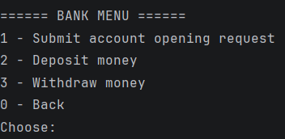
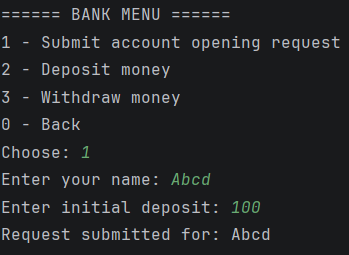
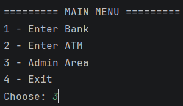
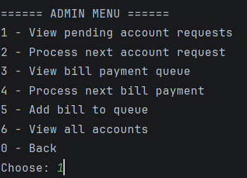
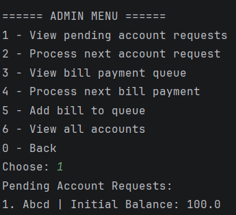
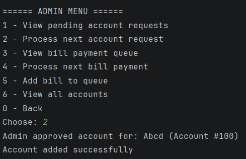
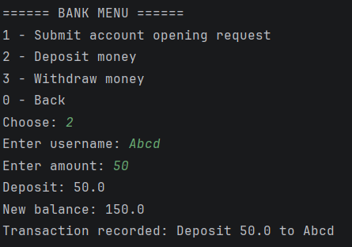
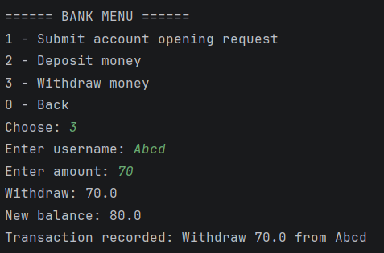
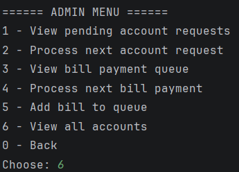
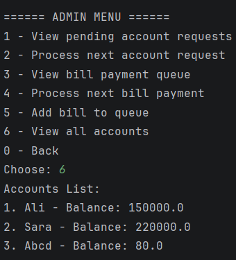

First interface for accessing other tasks

Bank Management system can be accessed with first menu

Let's request adding user "Abcd" with initial deposit - 100 from admin

Now let's go to Admin menu

let's view all pending account requests

As we can see request for adding "Abcd" with 100 on initial deposit is there
Now, let's process this request

So, our user "Abcd" is now in our linked list, let's try to do something in Bank management system

So we can deposit and withdraw money from users' balance
That's how 1 task is proved to work

let's view all users

All accounts are shown

